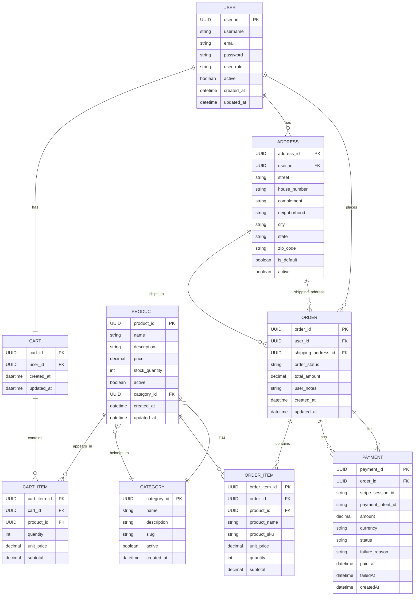

# 🛒 E-Commerce API

[](https://github.com/LuisMiguelPerinotte/ecommerce-api/actions)


[](LICENSE)


---

## ✨ Overview
E-Commerce API is a RESTful backend application built with Java 21 and Spring Boot.

It provides features for user authentication, product catalog management, shopping cart operations, order processing, address management and payment integration with Stripe.

The project was developed as a backend portfolio project, focusing on layered architecture, business rule validation, database migrations, external service integration, caching and automated tests.

> **Project Status:** In development 🚧 — contributions, issues and pull requests are welcome.

---

## 💡 Motivation

The goal of this project is to simulate the backend of a real e-commerce application while applying common backend engineering practices, such as:

- Layered architecture
- Authentication and authorization
- Database versioning
- Cache usage
- Payment gateway integration
- Automated testing
- API documentation

---

## 🚀 Features
| Feature                          | Status     | Description                                        |
|----------------------------------|------------|----------------------------------------------------|
| 👥 User registration/login       | Implemented | JWT-based authentication and authorization         |
| 📦 Product management            | Implemented | CRUD for products and categories                   |
| 🧺 Shopping cart                 | Implemented | Add/remove/update items, view cart                 |
| 🧾 Order processing              | Implemented | Place orders, order history                        |
| 💳 Payment integration           | Implemented | Stripe gateway integration                         |
| 🏠 Address management            | Implemented | Manage shipping addresses                          |
| 🛠️ Admin endpoints              |Implemented | Protected endpoints for managing catalog/users     |
| 📚 API documentation (Swagger)   | Implemented | Interactive API docs with Springdoc/OpenAPI        |
| ✅ Automated tests                | In Progress | Unit and integration tests for core business rules |

---

## 📌 Business Rules

- A user cannot register with an email that is already in use.
- A shopping cart is automatically created when a new user registers.
- Products can only be added to the cart if there is enough stock available.
- An order can only be created from a valid cart with items.
- Cart items are converted into order items when an order is created.
- Payment status changes are processed through Stripe webhooks.
- Approved payments update the related order status.
- Expired or failed payments do not complete the order.
- Common users cannot access administrative endpoints.
- Admin users cannot change their own role.

---

## 🏗️ Architecture

The project follows a layered architecture to separate responsibilities and keep the codebase easier to maintain and test.

- **API layer**: exposes REST endpoints and handles request/response DTOs.
- **Application layer**: contains business services and use case orchestration.
- **Domain layer**: contains entities, repositories and domain enums.
- **Infrastructure layer**: contains security, configuration, exception handling and external integrations.

Main flow:

```txt
Controller → Service → Repository → Database
```

---

## 🧠 Technical Decisions

- **JWT authentication** was used to keep the API stateless and protect private endpoints.
- **DTOs** are used to avoid exposing JPA entities directly through the API.
- **Flyway** is used to version and apply database schema changes safely.
- **Redis** is used as a cache layer to reduce unnecessary database access.
- **Stripe webhooks** are used to update payments asynchronously based on external payment events.
- **Global exception handling** centralizes API error responses and keeps controllers cleaner.
- **Layered architecture** separates HTTP concerns, business logic, domain models and infrastructure details.

---

## 🧩 Entity Relationship Diagram
The diagram below represents the main entities and relationships in the e-commerce domain.



---

### 🗂️ Directory Structure
```
 src/main/java/com/java/luismiguel/ecommerce_api
├── api              # Controllers and DTOs
├── application      # Business services
├── domain           # Entities, repositories and enums
└── infrastructure   # Security, exceptions, configs and integrations
```

---

## ⚙️ Configuration

The application uses environment variables for database, cache, JWT and Stripe configuration.

Create a `.env` file based on `.env.example`:

```bash
cp .env.example .env
```
### Main variables
```env
POSTGRES_DB_URL=jdbc:postgresql://localhost:5432/ecommerce_db
POSTGRES_DB_USER=ecom_user
POSTGRES_DB_PASSWORD=secret

REDIS_HOST=localhost
REDIS_PORT=6379
REDIS_PASSWORD=your_redis_password

JWT_SECRET=your_jwt_secret
JWT_EXPIRATION=3600000
JWT_REFRESH_EXPIRATION=604800000

# ADMIN ACCESS
ADMIN_EMAIL=admin@ecommerce.com
ADMIN_PASSWORD=$2a$10$xK9Lm...  ← BCrypt hash

STRIPE_API_KEY=your_stripe_api_key
STRIPE_WEBHOOK_SECRET=your_stripe_webhook_secret
```

For hosted databases, configure the same variables using your provider credentials.

---

## 🗃️ Database & Cache

The application uses **PostgreSQL** as the main database and **Redis** as a cache layer.

PostgreSQL stores the core application data, while Redis is used to cache frequently accessed data and reduce unnecessary database queries.

Both services can be started locally with Docker Compose:

```bash
docker-compose up -d postgres redis
```

---

## 📖 API Documentation

The API documentation is generated with Springdoc OpenAPI.

After starting the application, access:

- Swagger UI: `http://localhost:8080/swagger-ui/index.html`
- OpenAPI JSON: `http://localhost:8080/v3/api-docs`

---

## 🌐 Live Demo

The API is deployed on Render and can be accessed through the links below:

- **Base URL:** `https://ecommerce-api-gv78.onrender.com`
- **Swagger UI:** `https://ecommerce-api-gv78.onrender.com/swagger-ui/index.html`

> Note: The application may take a few seconds to respond on the first request because it is hosted on a free Render instance.

---

## 🏁 Getting Started

### ✅ Pre-requisites
- Java 21
- Maven
- Docker

### ▶️ Quick start (local dev)

```bash
git clone https://github.com/LuisMiguelPerinotte/ecommerce-api.git
cd ecommerce-api

cp .env.example .env

docker-compose up -d postgres redis

./mvnw spring-boot:run
```

---

### 🐳 Running with Docker
```bash
docker-compose up --build
```

---

## 🧪 Testing
The project includes automated tests focused on validating core business rules and service behavior.

Current test coverage includes:

- User registration flow
- Password encryption
- Automatic cart creation
- Product management rules
- Cart item manipulation
- Stock validation
- Exception scenarios
- Repository behavior

To run the tests:

```bash
./mvnw test
```
---

## Contributing 🤝
1. Fork the repository
2. Create a new branch (`git checkout -b feature/your-feature`)
3. Commit your changes
4. Push to your fork and open a Pull Request

Please include clear descriptions, tests for new logic, and keep commits atomic.
